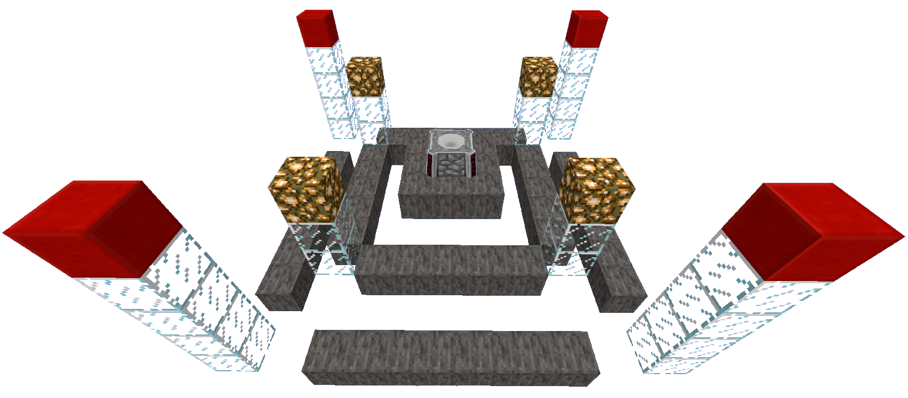
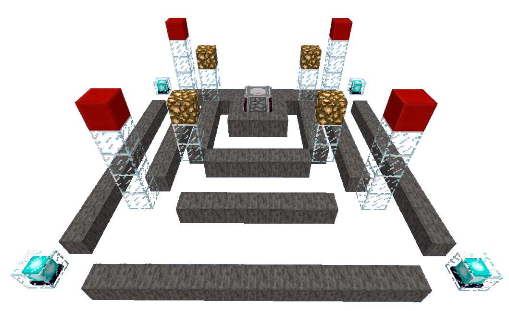
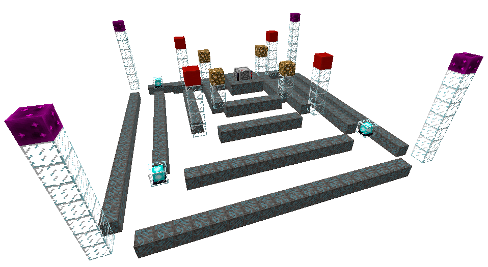

# Кровавый алтарь

## Руны. Типы рун. Свойства рун

В разделе [**Знакомство с модом**](broken-reference) упоминалось такое понятие, как \
`Уровень кровавого алтаря`\
В этом разделе мы разберём уровни кровавого алтаря и как их получать.

Существует всего 6 уровней кровавого алтаря. \
Чтобы повышать уровень кровавого алтаря нам понадобятся **Кровавые Руны**.&#x20;


Кровавые руны - блоки, необходимые для улучшения уровня кровавого алтаря.


Существует несколько типов рун:

<table><thead><tr><th width="98">Руна</th><th width="212" align="center">Название руны</th><th align="center">Свойства руны</th></tr></thead><tbody><tr><td></td><td align="center">Кровавая руна</td><td align="center">Без эффектов</td></tr><tr><td></td><td align="center">Руна скорости</td><td align="center">Увеличивает скорость крафта на 20%</td></tr><tr><td></td><td align="center">Руна дополнительной ёмкости</td><td align="center">Увеличивает ёмкость алтаря на 2 000 LP</td></tr><tr><td></td><td align="center">Руна улучшенной ёмкости</td><td align="center">Увеличивает ёмкость алтаря на 10%</td></tr><tr><td></td><td align="center">Руна дислокации</td><td align="center">Увеличивает скорость переноса жидкой LP на 20%</td></tr><tr><td></td><td align="center">Руна жертвоприношения</td><td align="center">Увеличивает LP, получаемый от жертвоприношения мобов, на 10%</td></tr><tr><td></td><td align="center">Руна самопожертвования</td><td align="center">Увеличивает LP, получаемые от самопожертвования, на 10%</td></tr><tr><td></td><td align="center">Руна Шара</td><td align="center">Увеличивает количество LP, которое может храниться в Кровавой сети, на 2%</td></tr><tr><td></td><td align="center">Руна эффективности</td><td align="center">Уменьшают прогресс, потерянный во время крафта, если на алтаре заканчивается кровь</td></tr><tr><td></td><td align="center">Руна ускорения</td><td align="center">Сокращает количество времени между крафтами на алтаре</td></tr></tbody></table>

:pushpin: [<mark style="color:yellow;">**`Особенность Рун Ёмкости`**</mark>](../interesno-znat/blood-magic.md#osobennost-run-yomkosti)&#x20;

## Уровни кровавого алтаря

Чтобы узнать какого уровня кровавый алтарь на данный момент нужно использовать [`Сигил Предсказания`](sigily.md) .

Уровень 1

<mark style="color:orange;">**Всего рун**</mark> - 0\
<mark style="color:orange;">**Новых рун**</mark> - 0\
<mark style="color:yellow;">**Габариты**</mark> - 1х1х1 блока\
Сам по себе блок кровавого алтаря имеет первый уровень. Не требует рун.\

Уровень 2

<mark style="color:orange;">**Всего рун**</mark>** -** 8\
<mark style="color:orange;">**Новых рун**</mark> - 8\
<mark style="color:yellow;">**Габариты**</mark> - 3х3х2 блока\
_Вокруг блока, под алтарем есть 8 кровавых рун . Под блоком алтаря руны быть не должно._\

Уровень 3

<mark style="color:orange;">**Всего рун**</mark> - 28\
<mark style="color:orange;">**Новых рун**</mark> - 20 _(по 5 с каждой стороны)_\
<mark style="color:yellow;">**Габариты**</mark> - 7х7х4 блока\
_Новые руны расположены на 2 блока дальше и на 1 блок ниже по сравнению с рунами второго уровня. Стекло можно заменить на любые твёрдые блоки._\
.png>)

Уровень 4

<mark style="color:orange;">**Всего рун**</mark> - 56\
<mark style="color:orange;">**Новых рун**</mark> - 28 _(по 7 с каждой стороны)_\
<mark style="color:yellow;">**Габариты**</mark> - 11х11х6 блока\
_Новые руны расположены на 2 блока дальше и на 1 блок ниже рун 3-го уровня. Требуются_ **`Кровавые кирпичи`**, _они должны быть расположены на 1 уровень выше_ **`Светокамня`**_. Обратите внимание, что между колонной и последней из кровавых рун с каждой стороны есть пространство, поэтому только 7 с каждой стороны._\

Уровень 5

<mark style="color:orange;">**Всего рун**</mark> - 108\
<mark style="color:orange;">**Новых рун**</mark> - 52 _(по 13 с каждой стороны)_\
<mark style="color:yellow;">**Габариты**</mark> - 17х17х7 блока\
Новые руны находятся на 3 блока дальше и на 1 блок ниже по сравнению с рунами уровня 4, руны будут на третьем блоке. По картинке сложно сказать, но **Маяки на один блок выше нового ряда рун**.\

Уровень 6

<mark style="color:orange;">**Всего рун**</mark> - 184\
<mark style="color:orange;">**Новых рун**</mark> - 76 _(по 19 с каждой стороны)_\
<mark style="color:yellow;">**Габариты**</mark> - 23х23х9 блока\
Новые руны расположены на 3 блока дальше и на 1 блок ниже по сравнению с рунами пятого уровня. Требуется на каждом углу поставить по блоку **`Кирпича Кристального Скопления`**, они должны быть на 1 уровень выше **`Кровавого Кирпича`**.\

:pushpin: [<mark style="color:yellow;">**`Как сжать Кровавый Алтарь в 1 блок`**</mark>](../interesno-znat/blood-magic.md#undefined)&#x20;


Если к алтарю крови поставить воронку, то через неё в алтарь можно поместить сразу 64 предмета.

