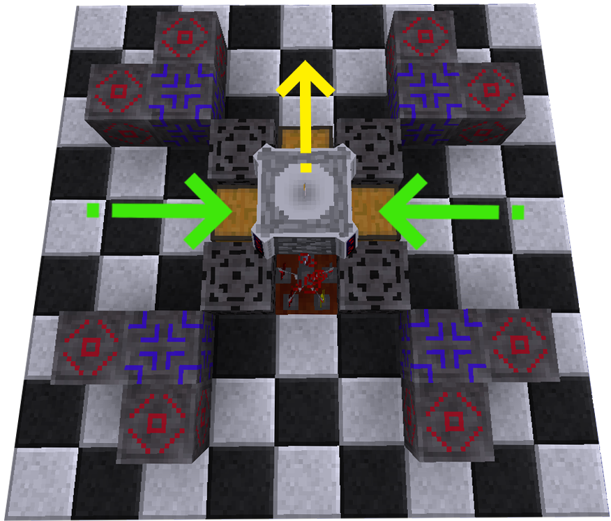

# 🔹 Ритуалы


**Ритуал** — это многоблочная структура, добавленная модификацией [<mark style="color:red;">**Blood Magic**</mark>](./) . Эффекты Ритуалов разнообразны, от простого источника воды до изменения целых биомов.


## Постройка ритуала

Для постройки ритуала нам понадобится 2 типа блоков:\
1\. <mark style="color:blue;">**Ритуальный камень**</mark> \
2\. <mark style="color:blue;">**Ритуальный камень мастера**</mark> \
Отличие их в том, что для ритуала всегда нужен только 1 **Ритуальный камень мастера** и некоторое количество Ритуальных Камней.

Чтобы выбрать и построить сам ритуал нам понадобится инструмент:\
<mark style="color:purple;">**Предсказатель Ритуала**</mark> \
Существует 3 уровня предсказателя ритуала. Внешне они ничем не отличаются, однако они имеют свои крафты и свойства.\
**1 Уровень** - не может размещать руны сумерек.\
**2 Уровень** - может размещать руны сумерек.\
**3 Уровень** - может размещать руны сумерек и рассвета.\
_`Например: В своей структуре ритуал содержит руну сумерек. В таком случае вам понадобится предсказатель ритуала минимум 2-го уровня.`_\
Чтобы построить ритуал вам нужно: \
1\. Поставить <mark style="color:blue;">Ритуальный камень мастера</mark> \
2\. Взять в инвентарь нужно количество <mark style="color:blue;">Ритуальных камней</mark> \
3\. Взять <mark style="color:purple;">Предсказатель ритуала</mark> \
\- Используя комбинацию клавиш `Shift + ПКМ` вы будете выбирать название ритуала.\
\- Кликнув `ПКМ` по Ритуальному Камню Мастера построится ритуал.


Чтобы быстро убрать построенный ритуал, используйте <mark style="color:orange;">**Ritual Dismantler**</mark> 


## Активация ритуала

Для активации ритуала нам понадобится **Кристалл Активации**. Существует 2 вида:\
1\. **Слабый Кристалл Активации** \
2\. **Пробуждённый Кристалл Активации** \
Разница в том, что `Пробуждённый кристалл активации` можно использовать для всех видов ритуалов, в то время как `Слабый кристалл активации` будет работать только на некоторые, более простые, ритуалы.\
Чтобы активировать ритуал, нужно нажать **Кристаллом Активации** по **Ритуальному Камню Мастера** `ПКМ`.

При удачной активации Ритуала вы увидите сообщение в чате:\
<mark style="color:green;">`Порыв потоков энергии проходит через ритуал!`</mark>


Не забудьте привязать <mark style="color:red;">**Кристалл Активации**</mark> к своей <mark style="color:red;">**Кровавой Сети**</mark>. **`Shift + ПКМ`**



Чтобы деактивировать ритуал, подайте сигнал красного камня на **Ритуальный Камень Мастера**.


## Виды Ритуалов

Ритуалы будут разделены на 2 раздела. В разделе **Полезные ритуалы** будут самые нужные и интересные ритуалы, о которых вам стоит знать. В разделе **Другие ритуалы** будут ритуалы, которые не так обходимы для выживания.

:pushpin: [<mark style="color:yellow;">**`Как сжать любой ритуал в 1 блок`**</mark>](../interesno-znat/blood-magic.md#undefined)&#x20;

### Полезные ритуалы

<details>

<summary>Ritual of Binding</summary>

**Стоимость Активации** -  5 000 LP\
Для активации требуется: <mark style="color:blue;">**Слабый Кристалл Активации**</mark>\
Количество ритуальных камней - 24\
<mark style="color:red;">**Описание**</mark> - Чтобы создать предмет вам нужно сбросить нужный предмет на ритуальный камень мастера и активировать ритуал. За 1 активацию ритуала можно создать только 1 предмет из рецепта. **Рекомендуется включить магнит, так как после трансформации предмет выпадет на землю!**\


</details>

_Создаёт некоторые предметы из мода Blood Magic_ :arrow\_up:

<details>

<summary>Ritual of Unbinding</summary>

**Стоимость Активации** - 30 000 LP\
Для активации требуется: <mark style="color:blue;">**Слабый Кристалл Активации**</mark>\
Количество ритуальных камней - 32\
<mark style="color:red;">**Описание**</mark> - Работает по той же механике, что и Ritual Of Binding. Скидываете нужный предмет на Ритуальный Камень Мастера и активируете ритуал.\
[_Реагенты_](alkhimiya.md): \
Sanctus - Ритуал будет отвязывать предметы от кровавой сети.\


</details>

_Делает тоже самое, что и Ritual of Binding, только наоборот._  :arrow\_up:\
_Способен отвязать предмет от кровавой сети владельца._

<details>

<summary>Well Of Suffering</summary>

**Стоимость Активации** - 50 000 LP\
Для активации требуется: <mark style="color:blue;">**Слабый Кристалл Активации**</mark>\
**Стоимость Поддержания Активным** - 2 LP/операция\
Количество ритуальных камней - 36\
Примечание: <mark style="color:green;">**Отличный способ получения крови на среднем этапе развития**</mark>\
<mark style="color:red;">**Описание**</mark> - Наносит 1 очко урона всем существам в радиусе 6 блоков включая Ритуальный Камень Мастера. Этот урон преобразуется в Эссенцию Жизни и направляется в Алтарь Крови, который расположен в радиусе 6 блоков. Каждое очко нанесенного урона стоит 2 LP из Кровавой сети активатора и генерирует 10 LP на Алтаре. Если в уровни алтаря входят руны жертвоприношения, то ритуал также получит бонус. Если Алтарь полон или Алтаря нет, Ритуал ничего не делает. Если в радиусе действия несколько Алтарей, только один из них будет заполнен. Ритуал скорее выберет алтарь под ним, чем над ним. Имейте это в виду при использовании нескольких алтарей.\
[_Реагенты_](alkhimiya.md): \
Potentia - Увеличивает вертикальный диапазон до 20. Общий диапазон (11x20x11)\
Tennebrae - Увеличивает количество LP в 2 раза.\
Offensa - Увеличивает LP и количество урона в 2 раза.\


</details>

Собирает LP из мобов:arrow\_up:

<details>

<summary>Aura of Expulsion</summary>

**Стоимость Активации** - 1 000 000 LP\
Для активации требуется: <mark style="color:blue;">**Слабый Кристалл Активации**</mark>\
**Стоимость Поддержания Активным** - 1 000 LP\
Количество ритуальных камней - 48\
<mark style="color:red;">**Описание**</mark> - Случайным образом телепортирует любого другого игрока, не внесенного в **"белый список"**, из кубической области 51x51x51 на расстояние 100 блоков. Чтобы добавить людей в **«белый список»**, поместите шар крови, принадлежащий игроку, в сундук поверх главного ритуального камня.\
[_Реагенты_](alkhimiya.md): \
Tenebrae - эффект будет действовать на все entity.\
Virtus - увеличивает дальность телепорта entity до 300 блоков.\
Potentia - увеличивает дальность телепортации до 101x101x101 блоков.\


</details>

_Телепортирует игроков_ :arrow\_up:

<details>

<summary>Ballad of Alchemy</summary>

**Стоимость Активации** - 20 000 LP \
Для активации требуется: <mark style="color:blue;">**Слабый Кристалл Активации**</mark>\
**Стоимость Поддержания Активным** - 60 LP за операцию + стоимость крафта\
Количество ритуальных камней - 16\
Дополнительные предметы для работы ритуала:\
\- Алтарь крови\
\- Сундук (минимум 2)\
\- Алхимическая и химическая установка\
<mark style="color:red;">**Описание**</mark> - Поместите кровавый шар (**привязанный**) в установку. Сундук напротив установки является <mark style="color:yellow;">**выходным**</mark>. Сундуки с других сторон - <mark style="color:green;">**входные**</mark>. Поместите предмет, который вы хотите создать в <mark style="color:orange;">**кровавый алтарь**</mark> над ритуальным камнем мастера и положите компоненты для крафта во <mark style="color:green;">**входные**</mark> сундуки.\
[_Реагенты_](alkhimiya.md): \
Potentia - Ускоряет работу в 5 раз\


</details>

_Автоматизация алхимической и химической установки_:arrow\_up:

<details>

<summary>Call of the Zephyr</summary>

**Стоимость Активации** - \
<mark style="color:yellow;">Может быть активирован:</mark> <mark style="color:blue;">**Слабым Кристаллом Активации**</mark>\
**Стоимость Поддержания Активным** - 5 LP за каждые 64 предмета\
Количество ритуальных камней - 12\
<mark style="color:red;">**Описание**</mark> - Ритуал собирает предметы из мира в кубе 21x21x21 и помещает эти предметы в инвентарь прямо над Ритуальным камнем мастера.\
[_Реагенты_](alkhimiya.md): \
Reductus - добавляет задержку в 60 тиков перед сбором предметов.\


</details>

_Собирает предметы_:arrow\_up:

<details>

<summary>Fisherman's Hymn</summary>

**Стоимость Активации** - 10 000 LP\
Для активации требуется: <mark style="color:blue;">**Слабый Кристалл Активации**</mark>\
Количество ритуальных камней - 20\
<mark style="color:red;">**Описание**</mark> - Поместите ритуал **над** водой и поставьте любой сундук на Ритуальный Камень Мастера.

</details>

_Автоматический рыбак_:arrow\_up:

<details>

<summary>Focus of the Ellipsoid</summary>

**Стоимость Активации** - 25 000 LP\
Для активации требуется: <mark style="color:blue;">**Слабый Кристалл Активации**</mark>\
**Стоимость Поддержания Активным** - 20 \* \[радиус] LP/сек\
Количество ритуальных камней - 36\
<mark style="color:red;">**Описание**</mark> - Поставьте 2 сундука. 1 над и 1 под Ритуальный Камень Мастера. В нижний сундук положите блоки, из которых будет строиться Эллипсоид. В верхний сундук выложите определённое количество предметов (в первые 3 слота) для обозначения радиуса.\
Слот 1 - радиус x\
Слот 2 - радиус y\
Слот 3 - радиус z&#x20;

</details>

_Создаёт эллипсоид с указанным радиусом_:arrow\_up:

<details>

<summary>Orchestra of the Phantom Hands</summary>

**Стоимость Активации** - 10 000 LP\
Для активации требуется: <mark style="color:blue;">**Слабый Кристалл Активации**</mark>\
Количество ритуальных камней - 24\
<mark style="color:red;">**Описание**</mark> - Механику ритуала довольно сложно описать, но прочитать вы её можете здесь:\
[Orchestra of the Phantom Hands](https://ftbwiki.org/Orchestra\_of\_the\_Phantom\_Hands)

</details>

_Переносит предметы_:arrow\_up:

<details>

<summary>Ritual of Gaia's Transformation</summary>

**Стоимость Активации** - 1 000 000 LP\
Для активации требуется: <mark style="color:orange;">**Пробуждённый Кристалл Активации**</mark>\
Количество ритуальных камней - 116\
Примечание: <mark style="color:green;">**Ритуал может взаимодействовать с модом Forestry!**</mark>\
<mark style="color:red;">**Описание**</mark> - Вокруг ритуального камня мастера расставьте 8 Тайных Постаментов . Чтобы изменять параметры биома на эти постаменты нужно выкладывать определённые ресурсы, в зависимости от нужных вам условий.

```
Песок: влажность - 0,1 
Песчаник: влажность - 0,2 
Адский камень: влажность - 0,4
Лазурит: влажность + 0,1 
Ведро с водой: влажность + 0,2 
Блок лазурита: влажность + 0,4
Уголь: температура + 0,1 
Угольный блок: температура + 0,2 
Ведро лавы: температура + 0,4
Снежок: температура - 0,1 
Блок снега: температура - 0,2 
Блок Льда: температура - 0,4
```

Список предметов для создания любого биома тут - [<mark style="color:red;">**Ссылка**</mark>](https://pastebin.com/nJG7wgtD)

Если ритуал не сможет найти биом, зарегистрированный в списке, он просто устанавливает биом как «равнинный» биом с идентификатором биома 1. Поэтому, если вы просто активируете ритуал без предметов, то биом сменится на "Равнина" или "Океан".

При активации Ритуал изменит параметры биома в области 21x21x21 блок. Но её можно настроить с помощью Кровавого Кирпича, разместив рамку из них на 1 блок выше Ритуальных Камней. Ритуал изменит биом в указанной области, **в том числе и в блоках самой рамки!**


</details>

_Изменяет биом (температуру/влажность)_:arrow\_up:

<details>

<summary>The Enchantress's Spell</summary>

**Стоимость Активации** - 50 000 LP\
Для активации требуется: <mark style="color:orange;">**Пробуждённый Кристалл Активации**</mark>\
Количество ритуальных камней - 68\
<mark style="color:red;">**Описание**</mark> - Для ритуала необходимы 4 пьедестала, расположенные на небольших платформах с центром из Рун Сумерек и Кровавый Алтарь поверх Ритуального камня мастера. Вы кладете предмет, который хотите зачаровать, в алтарь, а зачарованные книги (минимум 1, максимум 4) в любой из пьедесталов. Этот Ритуал потребляет разное количество LP для зачарования, но 50 000 LP для активации.\


</details>

_Зачаровывает предметы с помощью зачарованных книг_:arrow\_up:

<details>

<summary>Reverence of the Condor</summary>

**Стоимость Активации** - 1 000 000 LP\
Для активации требуется: <mark style="color:orange;">**Пробуждённый Кристалл Активации**</mark>\
Количество ритуальных камней - 88\
<mark style="color:red;">**Описание**</mark> - В области 41х41х61 **постоянно** даёт игроку эффект Flight на 1 секунду. С помощью которого вы можете летать как в креативе. Также убирает урон от падения в пределах действия.\
[_Реагенты_](alkhimiya.md): \
Эфир - Увеличивает продолжительность баффа полета до 30 секунд.

</details>

_Даёт креативный полёт_:arrow\_up:

<details>

<summary>Convocation of the Damned</summary>

**Стоимость Активации** - 15 000 000 LP\
Для активации требуется: <mark style="color:orange;">**Пробуждённый Кристалл Активации**</mark>\
Количество ритуальных камней - 128\
Дополнительно:\
x8 Кристальный колпак \
x4 Алхимическое реле\
<mark style="color:green;">**magicales, potentia, incendium, terrae, tenebrae, sanctus, aquasalus, Эфир**</mark> (x16)\
<mark style="color:red;">**Описание**</mark> - Заполните реагентами 8 Кристальных колпаков и расставьте их по 1 на каждой колонне. Вокруг ритуального камня мастера расставьте 4 Алхимических реле (см. картинку ниже). Свяжите Колпаки с Реле, а сами реле к ритуальному камню мастера с помощью [Алхимического маршрутизатора](alkhimiya.md).\
Поместите Кровавый алтарь поверх Ритуального Камня Мастера.\
Как только ритуал будет активирован и все реагенты будут поглощены, используйте **кристалл демона**, чтобы вызвать демона поверх Ритуального Камня Мастера. Затем убейте демона на кровавом алтаре, используя **Кинжал жертвоприношения** .\


</details>

_Создаёт деревню демонов и блок демонического портала._:arrow\_up:

### Другие ритуалы

<details>

<summary>Blood of the New Moon</summary>

**Стоимость Активации** - 10 000 LP\
Для активации требуется: <mark style="color:orange;">**Пробуждённый Кристалл Активации**</mark>\
Количество ритуальных камней - 16\
<mark style="color:red;">**Описание**</mark> - После активации ритуала требуется инвентарь (например, сундук), который нужно поместить над Ритуальным камнем Мастера. Этот инвентарь используется для определения настроек ритуалов:

* Первый слот устанавливает радиус ритуала, но ограничен максимальным размером 32.
* Второй слот определяет расстояние выше/ниже ритуала, на которое/от которого должны перемещаться блоки. Эта сумма должна быть как минимум на 3 больше, чем сумма в первом слоте.\
  [_Реагенты_](alkhimiya.md): \
  Terrae - Ставит землю в месте кратера.\
  

</details>

_Поднимает сферу земли в воздух_:arrow\_up:

<details>

<summary>Cry of the Eternal Soul</summary>

**Стоимость Активации** - 2 000 000 LP\
Для активации требуется: <mark style="color:orange;">**Пробуждённый Кристалл Активации**</mark>\
**Стоимость Поддержания Активным** - 2 LP за операцию\
Количество ритуальных камней - 78\
<mark style="color:red;">**Описание**</mark> - Ритуал устанавливается вокруг кровавого алтаря. <mark style="color:red;">**Пока он активен устанавливает владельцу 1 сердце**</mark>. \
[_Реагенты_](alkhimiya.md): \
Sanctus - Устанавливает владельцу 3 сердца. Работает раз в 10 секунд.\


```
Есть более лучшая альтернатива из мода Blood Arsenal - 
Материализатор жизненной эссенции.
```

</details>

_Переносит кровь из кровавой сети в кровавый алтарь._:arrow\_up:

<details>

<summary>Dome of Suppression</summary>

**Стоимость Активации** - 10 000 LP\
Для активации требуется: <mark style="color:blue;">**Слабый Кристалл Активации**</mark>\
**Стоимость Поддержания Активным** - 80 LP/секунду\
Количество ритуальных камней - 12\
<mark style="color:red;">**Описание**</mark> - Во время действия временно удаляет жидкости в сфере радиусом 10 блоков\
[_Реагенты_](alkhimiya.md): \
Эфир - Увеличивает радиус до 20\
Aquasalus - Увеличивает радиус до 15\


</details>

Создаёт воздушный купол в жидкостях.:arrow\_up:

<details>

<summary>Symmetry of the Omega</summary>

**Стоимость Активации** - 15 000 000 LP\
Для активации требуется: <mark style="color:orange;">**Пробуждённый Кристалл Активации**</mark>\
Количество ритуальных камней - 116\
<mark style="color:red;">**Описание**</mark> - Прежде чем активировать Ритуал, вам необходимо выполнить несколько шагов:

* Вы должны носить Связанную Броню .
* В ритуальной структуре есть 4 отверстия для Кристальных Колпаков. Поместите в 2 из них поместите Колпаки с необходимыми реагентами. Остальные отверстия нужно закрыть любыми блоками.
* Необходимо сделать закрытую комнату из блоков на структуре ритуала. Игрок должен быть внутри. Размер помещения не должен быть больше 5 блоков от центра ритуала. То есть внутренняя площадь комнаты не должна превышать 9х9х4 (ширина\*длина\*высота).
* Чтобы усилить эффекты омега-брони, следует использовать глифы вместо обычных блоков для постройки комнаты.
* Потолок комнаты должен быть полностью закрыт стеклом.

\
В зависимости от реагентов, помещённых в колпаки будут разные виды брони. Всего есть 4 вида брони, а аспекты, которые нужны для их создания:\
Aquasalus / Terrae / Incendium / Эфир

</details>

_Создаёт Омега-броню_:arrow\_up:

<details>

<summary>Duet of the Fused Souls</summary>

**Стоимость Активации** - 15 000 000 LP\
Для активации требуется: <mark style="color:orange;">**Пробуждённый Кристалл Активации**</mark>\
**Стоимость Поддержания Активным** - 5 000 LP/сек\
Количество ритуальных камней - 124\
<mark style="color:red;">**Описание**</mark> - Ритуал сделан так, чтобы внутри него работал маяк уровня 4 , маяк должен быть активен, чтобы ритуал вступил в силу. Ритуал потребляет 5000 LP/сек, чтобы предотвратить истощение реагентов, в результате чего Омега броня прослужит бесконечно и воздействует на игрока только тогда, когда он находится в пределах диапазона маяка, используемого в ритуале.

</details>

_Предотвращает истощение регентов, используемых для активации Омега брони_:arrow\_up:

<details>

<summary>Interdiction Ritual</summary>

**Стоимость Активации** - 1 000 LP\
Для активации требуется: <mark style="color:blue;">**Слабый Кристалл Активации**</mark>\
**Стоимость Поддержания Активным** - 1 LP/операция\
Количество ритуальных камней - 8\
<mark style="color:red;">**Описание**</mark> - Ритуал отталкивает мобов в области 10x10x10. Перемещение моба стоит примерно 1 LP, хотя стоимость, по-видимому, зависит от скорости моба.\
[_Реагенты_](alkhimiya.md): \
Magicales - ритуал работает на игроков\
Эфир - ритуал работает на предметы

</details>

_Отталкивает мобов_:arrow\_up:

<details>

<summary>Midas Touch</summary>

**Стоимость Активации** - 5 000 LP\
Для активации требуется: <mark style="color:blue;">**Слабый Кристалл Активации**</mark>\
Количество ритуальных камней - 28\
<mark style="color:red;">**Описание**</mark> - Превращает железо в золото с шансом 5/7

</details>

_Превращает железные слитки в золотые_:arrow\_up:

<details>

<summary>Reap of the Harvest Moon</summary>

**Стоимость Активации** - 20 000 LP\
Для активации требуется: <mark style="color:blue;">**Слабый Кристалл Активации**</mark>\
**Стоимость Поддержания Активным** - 40 LP/1 растение\
Количество ритуальных камней - 24\
<mark style="color:red;">**Описание**</mark> - Ищет растения в радиусе 9x9x9 блоков и ломает их, если растение выросло. Если из растения выпало семечко, то ритуал его автоматически посадит. <mark style="color:orange;">**Обратите внимание!**</mark>

* **Выпавшие культуры ритуал НЕ собирает**.&#x20;
* Ритуал не рубит деревья.

Площадь поиска можно увеличить разместив под Ритуальным Камнем Мастера драгоценные блоки (x y z):\
Алмазный блок - 31x9x31 \
Золотой блок - 21x9x21\
Железный блок - 13x9x13

[_Реагенты_](ritualy.md#reagenty): \
Terrae - Ритуал будет работать с блоком грязи

</details>

_Полуавтоматический сбор урожая_:arrow\_up:

<details>

<summary>Requiem of the Satiated Stomach</summary>

**Стоимость Активации** - 100 000 LP\
Для активации требуется: <mark style="color:blue;">**Слабый Кристалл Активации**</mark>\
**Стоимость Поддержания Активным** - 100 LP/операция\
Количество ритуальных камней - 28\
<mark style="color:red;">**Описание**</mark> - Ищет еду в инвентаре над Ритуальным Камнем Мастера и кормит ей игроков в области 33x33x33. Ритуал применяет только насыщение потребляемого предмета. Это предотвратит уменьшение шкалы голода игрока, но **не заполнит** ее обратно.

</details>

_Кормит игроков_:arrow\_up:

<details>

<summary>Rhythm of the Beating Anvil</summary>

**Стоимость Активации** - 15 000 LP\
Для активации требуется: <mark style="color:blue;">**Слабый Кристалл Активации**</mark>\
**Стоимость Поддержания Активным** - 10 LP/операция\
Количество ритуальных камней - 26\
<mark style="color:red;">**Описание**</mark> - Прежде чем активировать Ритуал, вам необходимо выполнить несколько шагов:

* Поставьте пьедесталы и сундуки в тех местах, как показано.
* Ставьте предметы на пьедесталы согласно рецепту. Нижняя часть рецепта со стороны водяного камня.

Сундук, отмеченный камнем воды - выход, там будет готовая продукция. Остальные три сундука предназначены для сырья.\


</details>

_Примитивный автокрафт_:arrow\_up:

<details>

<summary>Ritual of Containment</summary>

**Стоимость Активации** - 2 000 LP\
Для активации требуется: <mark style="color:blue;">**Слабый Кристалл Активации**</mark>\
**Стоимость Поддержания Активным** - 1 LP/сек\
Количество ритуальных камней - 16\
<mark style="color:red;">**Описание**</mark> - Притягивает мобов к Ритуальному Камню Мастера в области 5x5x5.\
**Ритуал будет хорошо сочетаться с ритуалом Well of Suffering**.\
[_Реагенты_](alkhimiya.md): \
Terrae - увеличивает область до 10x10x10\
Crepitous - предотвращает взрыв криперов

</details>

_Притягивает мобов_:arrow\_up:

<details>

<summary>Ritual of Magnetism</summary>

**Стоимость Активации** - 5 000 LP\
Для активации требуется: <mark style="color:blue;">**Слабый Кристалл Активации**</mark>\
**Стоимость Поддержания Активным** - 50 LP/операция\
Количество ритуальных камней - 16\
<mark style="color:red;">**Описание**</mark> - Ищет руды в области 3х3 под ним вплоть до бедрока. Когда он что-то находит, он телепортирует блок в куб 3x3x3 над Ритуальным Камнем Мастера. Каждый телепортированный блок стоит 50 LP. Блоки телепортируются со скоростью: 1 блок каждые 40 тиков (2 секунды).

Ritual of Magnetism можно объединить с Ritual of the Crusher для создания автоматизированной системы добычи полезных ископаемых.\
[_Реагенты_](alkhimiya.md): \
Terrae - Увеличивает зону поиска до 7x7\
Orbis Terrae - Увеличивает зону поиска до 12x12\
Terrae + Orbis Terrae - Увеличивает зону поиска до 31x31\
Potentia - Увеличивает скорость до 10 тиков (0.5 секунды)\


</details>

_Телепортирует руды на поверхность_:arrow\_up:

<details>

<summary>Ritual of the Crusher</summary>

**Стоимость Активации** - 2 500 LP\
Для активации требуется: <mark style="color:blue;">**Слабый Кристалл Активации**</mark>\
**Стоимость Поддержания Активным** - 7 LP/операция\
Количество ритуальных камней - 16\
<mark style="color:red;">**Описание**</mark> -  Вскапывает блоки из куба 3x3x3 прямо под Ритуальным Камнем Мастера и помещает их в инвентарь над ним.\
Ritual of the Crusher можно объединить с Ritual of Magnetism для создания автоматизированной системы добычи полезных ископаемых.\
[_Реагенты_](alkhimiya.md): \
Orbis Terrae - Удача I\
Potentia - Удача I\
Virtus - Удача I\
Orbis Terrae + Potentia + Virtus - Удача III\
Crystallos - Шёлковое касание\


</details>

_Вскапывает блоки_:arrow\_up:

<details>

<summary>Ritual of Mob Oppression</summary>

**Стоимость Активации** - 25 000 LP\
Для активации требуется: <mark style="color:orange;">**Пробуждённый Кристалл Активации**</mark>\
Количество ритуальных камней - 24\
<mark style="color:red;">**Описание**</mark> - При активации Ритуал накладывает на мобов парализующий эффект в виде сферы радиусом 10. (_Эффект не действует на Слизнях!)_\


</details>

_Парализует мобов_:arrow\_up:

<details>

<summary>Ritual of Regeneration</summary>

**Стоимость Активации** - 25 000 LP\
Для активации требуется: <mark style="color:blue;">**Слабый Кристалл Активации**</mark>\
**Стоимость Поддержания Активным** - 20-200 LP/операция\
Количество ритуальных камней - 44\
<mark style="color:red;">**Описание**</mark> - Ритуал регенерации применяет регенерацию длительностью 2 секунды к любому объекту в радиусе 6 блоков (диаметр 11 блоков). Это стоит 200 LP для игроков и 20 LP для других объектов. Регенерация применяется только в том случае, если у Entity еще нет максимального здоровья.\
Форма ритуала такая, что его можно частично перекрыть ритуалами Well of Suffering или Ritual of the Feathered Knife, для экономии места и красоты.\
[_Реагенты_](alkhimiya.md): \
Reductus - Регенерация будет работать только для игроков\
Virtus - Повышает уровень регенерации, но увеличивает стоимость LP в 3 раза\
Praesidium - Увеличивает радиус действия в 3 раза.\


</details>

_Восстанавливает здоровье игроков/мобов_:arrow\_up:

<details>

<summary>Ritual of Speed</summary>

**Стоимость Активации** - 1 000 LP\
Для активации требуется: <mark style="color:blue;">**Слабый Кристалл Активации**</mark>\
**Стоимость Поддержания Активным** - 5 LP/операция\
Количество ритуальных камней - 9\
<mark style="color:red;">**Описание**</mark> - Толкает любое существо над ним примерно на 32 блока в направлении руны сумерек. Проблема ритуала в том, что он строится всегда в одном направлении. Поэтому, чтобы указать своё направление, возможно, придётся строить ритуал вручную.\
[_Реагенты_](alkhimiya.md): \
Эфир - Увеличивает дальность броска\
Terrae - Уменьшает дальность броска\
Reductus - Убирает урон от падения во время броска\
Tenebrae - Ритуал будет подбрасывать только взрослых животных\
Sanctus - Ритуал будет подбрасывать только детёнышей животных\


</details>

_Подбрасывает игроков/мобов в указанном направлении_:arrow\_up:

<details>

<summary>Ritual of Withering</summary>

**Стоимость Активации** - 75 000 LP\
Для активации требуется: <mark style="color:orange;">**Пробуждённый Кристалл Активации**</mark>\
**Стоимость Поддержания Активным** -  330 LP/тик за 1 игрока/моба\
Количество ритуальных камней - 56\
<mark style="color:red;">**Описание**</mark> - Накладывает Эффект Иссушения на мобов и игроков в области 14x14x14\


</details>

_Накладывает Эффект Иссушения на мобов и игроков_:arrow\_up:

<details>

<summary>Ritual of the Feathered Earth</summary>

**Стоимость Активации** - 100 000 LP\
Для активации требуется: <mark style="color:orange;">**Пробуждённый Кристалл Активации**</mark>\
Количество ритуальных камней - 40\
<mark style="color:red;">**Описание**</mark> - Убирает урон от падения в области of 41x41x61\
[_Реагенты_](alkhimiya.md): \
Эфир - Увеличивает вертикальный диапазон до 60\
Terrae - Увеличивает горизонтальный диапазон до 30\
Orbis Terrae - Увеличивает горизонтальный диапазон до 45\
Terrae + Orbis Terrae - Увеличивает горизонтальный диапазон до 64\


</details>

_Убирает урон от падения_:arrow\_up:

<details>

<summary>Ritual of the Feathered Knife</summary>

**Стоимость Активации** - 50 000 LP\
Для активации требуется: <mark style="color:blue;">**Слабый Кристалл Активации**</mark>\
**Стоимость Поддержания Активным** - 20 LP/операция\
Количество ритуальных камней - 40\
<mark style="color:red;">**Описание**</mark> - Ищет игроков в области 31x31x41, наносит им один урон и создает 100 LP на ближайшем Кровавом Алтаре. Этот эффект распространяется на любые Руны Самопожертвования вокруг Алтаря.

Ритуал не уменьшит здоровье игрока ниже 3 сердец.

Ритуал можно комбинировать с Ritual of Regeneration для более продуктивной добычи крови.\
[_Реагенты_](alkhimiya.md): \
Sanctus - Не снижает здоровье ниже 7 сердец\
Reductus - Уменьшает диапазон до 17x17x17\
Magicales - Ритуал работает только на активатора\
Potentia - Удваивает скорость ритуала

</details>

_Автоматический жертвенный кинжал_:arrow\_up:

<details>

<summary>Ritual of the Full Spring</summary>

**Стоимость Активации** - 500 LP\
Для активации требуется: <mark style="color:blue;">**Слабый Кристалл Активации**</mark>\
**Стоимость Поддержания Активным** - 25 LP/операция\
Количество ритуальных камней - 4\
<mark style="color:red;">**Описание**</mark> - Создаёт источник воды над ритуальным камнем мастера. Когда источник воды пропадёт, то ритуал автоматически создаст новый.\
[_Реагенты_](alkhimiya.md): \
Aquasalus - Увлажняет всю почву в пределах области 9 x 7 x 9\
Offensa  - Дает утопление всем мобам в радиусе 10 блоков\
Crystallos - Создает снег и лед вокруг ритуала в области 5 x 5 x 5\
Sanctus - Наполняет резервуар над Ритуальным Камнем Мастера водой.\
Reductus - Дает владельцу ритуала иммунитет к эффекту утопления\


</details>

_Создаёт источник воды_:arrow\_up:

<details>

<summary>Serenade of the Nether</summary>

**Стоимость Активации** - 10 000 LP\
Для активации требуется: <mark style="color:blue;">**Слабый Кристалл Активации**</mark>\
**Стоимость Поддержания Активным** - 500 LP/операция\
Количество ритуальных камней - 4\
<mark style="color:red;">**Описание**</mark> - Создаёт источник лавы над ритуальным камнем мастера. Когда источник воды пропадёт, то ритуал автоматически создаст новый.\
[_Реагенты_](alkhimiya.md): \
Sanctus - Заполняет резервуар лавой над Ритуальным Камнем Мастера\


</details>

_Создаёт источник лавы_:arrow\_up:

<details>

<summary>Ritual of the Green Grove</summary>

**Стоимость Активации** - 1000 LP\
Для активации требуется: <mark style="color:blue;">**Слабый Кристалл Активации**</mark>\
**Стоимость Поддержания Активным** - 20 LP/сек\
Количество ритуальных камней - 8\
<mark style="color:red;">**Описание**</mark> - Даёт эффект удобрения к растениям в области 3х3 на два блока выше ритуала. Потребляет LP пока в области есть растения.\
[_Реагенты_](alkhimiya.md): \
Terrae - Ускоряет рост урожая\
Orbis Terrae - Ускоряет рост урожая\
Aquasalus - Увлажняет блоки\
Virtus - Увеличивает дальность Ритуала до 9х9\
`Бонус к скорости роста у Orbis Terrae немного больше, чем у Terrae. Оба бонуса суммируются.`\


</details>

_Увеличивает скорость роста растений_:arrow\_up:

<details>

<summary>Ritual of the High Jump</summary>

**Стоимость Активации** - 1 000 LP\
Для активации требуется: <mark style="color:blue;">**Слабый Кристалл Активации**</mark>\
**Стоимость Поддержания Активным** - 5 LP/операция\
Количество ритуальных камней - 12\
<mark style="color:red;">**Описание**</mark> - Подбрасывает любую сущность на 12 блоков в воздух. Если сущность упадёт на Ритуальный Камень Мастера, то урон от падения будет аннулирован.\
[_Реагенты_](alkhimiya.md): \
Эфир - Увеличивает высоту броска\
Terrae - Увеличивает диапазон предотвращения урона от падения\


</details>

_Подбрасывает игроков/мобов в воздух_:arrow\_up:

<details>

<summary>Ritual of the Shepherd</summary>

**Стоимость Активации** - 10 000 LP\
Для активации требуется: <mark style="color:blue;">**Слабый Кристалл Активации**</mark>\
**Стоимость Поддержания Активным** - 400 LP/операция\
Количество ритуальных камней - 16 \
<mark style="color:red;">**Описание**</mark> - Сокращает время, необходимое для созревания животных, с 20 до 3 минут

</details>

_Увеличивает скорость роста животных_:arrow\_up:

<details>

<summary>Song of Evaporation</summary>

**Стоимость Активации** - 20 000 LP\
Для активации требуется: <mark style="color:blue;">**Слабый Кристалл Активации**</mark>\
Количество ритуальных камней - 36\
<mark style="color:red;">**Описание**</mark> - Ищет через воздушные блоки любые жидкости, вытесненные Сигилом Подавления или Ритуалом Dome of Supression в области 19x19x19. Любая вытесненная жидкость, которую он находит, уничтожается. Это разовая операция.

</details>

_Уничтожает вытесненные жидкости_:arrow\_up:

<details>

<summary>Veil of Evil</summary>

**Стоимость Активации** - 150 000 LP\
Для активации требуется: <mark style="color:blue;">**Слабый Кристалл Активации**</mark>\
**Стоимость Поддержания Активным** - 20 LP/сек\
Количество ритуальных камней - 72\
<mark style="color:red;">**Описание**</mark> - Позволяет враждебным мобам появляться независимо от уровня освещенности в кубе 65x65x65.

</details>

_Позволяет появляться враждебным мобам_:arrow\_up:

<details>

<summary>Ward of Sacrosanctity</summary>

**Стоимость Активации** - 150 000 LP\
Для активации требуется: <mark style="color:blue;">**Слабый Кристалл Активации**</mark>\
**Стоимость Поддержания Активным** - 300 LP/сек\
Количество ритуальных камней - 32\
<mark style="color:red;">**Описание**</mark> - Предотвращает появление враждебных мобов в пределах куба 63x63x63

</details>

Предотвращает появление мобов:arrow\_up:


Некоторые ритуалы были взяты из аддона к моду Blood Magic - <mark style="color:red;">**Blood Arsenal**</mark>

