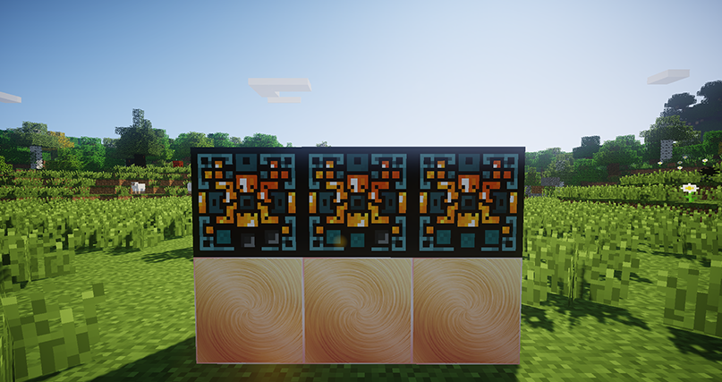
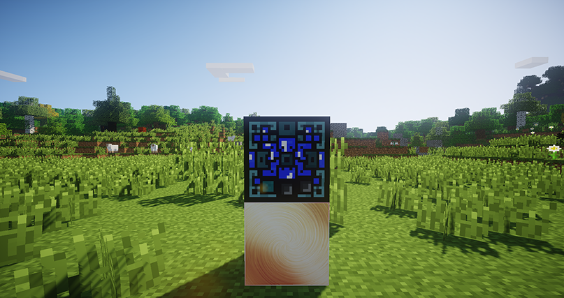

# Генератор воды и лавы

#### Генераторы лавы (3 уровня)

Генерирует и хранит лаву, используя энергию. Имеет слоты для наполнения хранилищ для жидкостей.

Имеет три уровня, с каждым уровнем эффективность _генератора_ возрастает:

1 уровень — 10 бакитов лавы за 100 000 EU\
2 уровень — 25 бакитов лавы за 100 000 EU\
3 уровень — 50 бакитов лавы за 100 000 EU

<figure><figcaption>
Генераторы лавы
</figcaption></figure>

#### Генератор воды

Работает по такому же принципу как и генератор лавы, только генерирует воду.

<figure><figcaption>
Генератор воды
</figcaption></figure>

&#x20;

