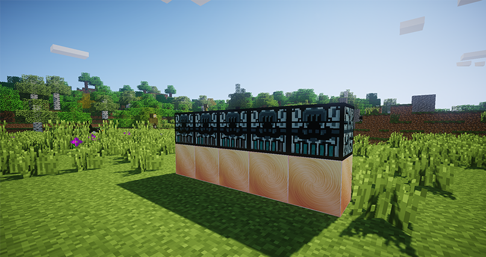

# Генераторы нейтрония

Появились новые _сингулярные генераторы нейтрония_. Они имеют 5 уровней. С каждым уровнем скорость создания _нейтрония_ возрастает. Узнать уровень механизма можно с помощью специальной шкалы в интерфейсе или по передней панели механизма.

<figure><figcaption>
Сингулярные генераторы нейтрония
</figcaption></figure>
