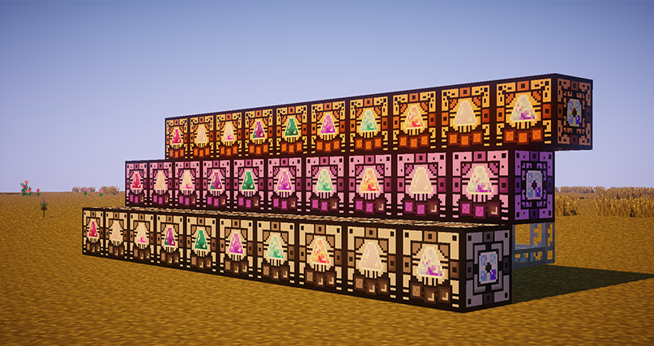

# Генераторы твердой материи

<mark style="color:blue;">**Генератор твердой материи**</mark>** (10 уровней)**\
С помощью _генераторов твердой материи_ вы можете синтезировать твердую материю.

Каждому из 10 уровней этих механизмов соответствует 1 вид твердой материи из мода LoliEnergistics: _сыпучая светло-розовая_, _мутировавшая фиолетово-бирюзовая_, _искрящаяся_ или иная.\
Уровень отображается в интерфейсе на специальной шкале, а также на передней панели механизма.

<mark style="color:purple;">**Расширенный генератор твердой материи**</mark>** (10 уровней)**\
_Расширенные генераторы твердой материи_ — это те же _генераторы твердой материи_, однако с увеличенным количеством слотов. В этих механизмах их 6.

<mark style="color:orange;">**Промышленный генератор твердой материи**</mark>** (10 уровней)**\
В _промышленных генераторах твердой материи_ слотов еще больше. В этих механизмах их 12. Перерабатывайте ваши ресурсы до 12 раз эффективнее без увеличения сети механизмов!

<figure><figcaption>
Генераторы твердой материи
</figcaption></figure>
