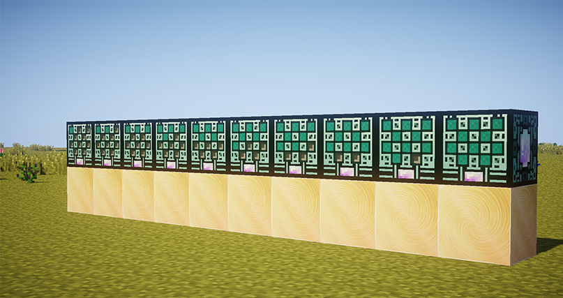

# Генераторы жидкой материи

_<mark style="color:blue;">**Генераторы жидкой материи**</mark>_ синтезируют _жидкую материю_ и тоже имеют 10 уровней. С увеличением уровня синтез материи ускоряется. Уровень так же отображается на специальной шкале в интерфейсе и на передней панели механизма.


Повышение уровня генератора, увеличивает кол-во синтезируемой материи на 1мб

1 уровень 2мб, 2 уровень - 3мб и.т.д


<figure><figcaption>
Генераторы жидкой материи
</figcaption></figure>
