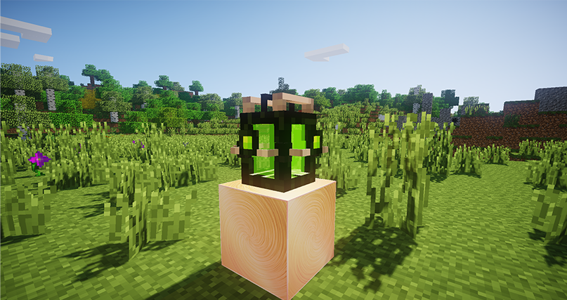

# Молекулярная ферма

_Молекулярная ферма_ добавлена, чтобы упростить создание ферм из _Forestry_ и других модов для автоматической добычи дерева или еды. Работает по принципу _молекулярного преобразователя_, но использует только энергию. Способна сама отдавать предметы в МЭ интерфейс.


Все доступные рецепты в молекулярной ферме, можно посмотреть в NEI


<figure><figcaption>
Молекулярная ферма
</figcaption></figure>
