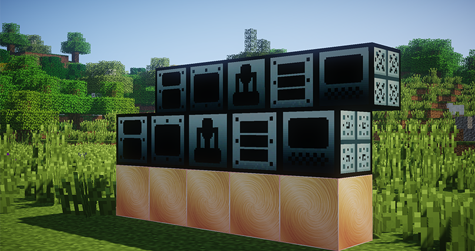
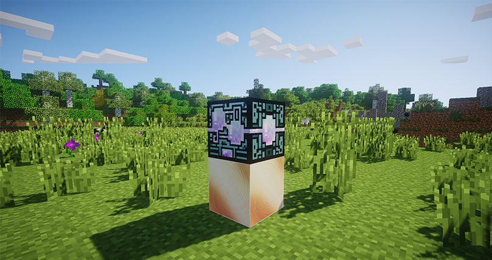
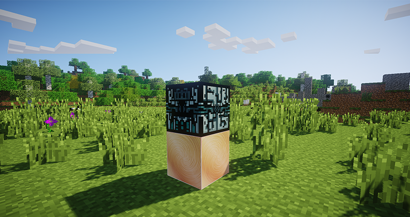
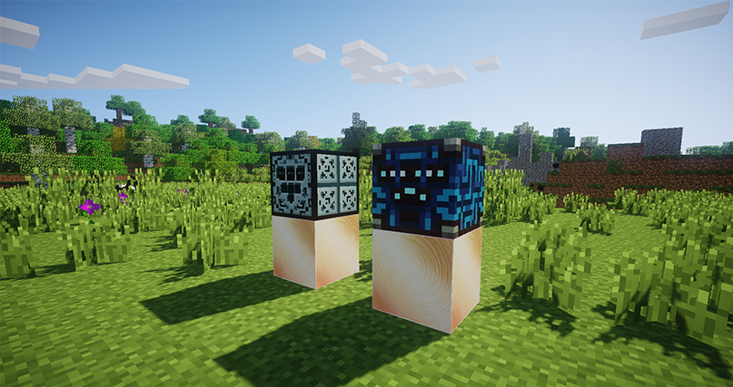
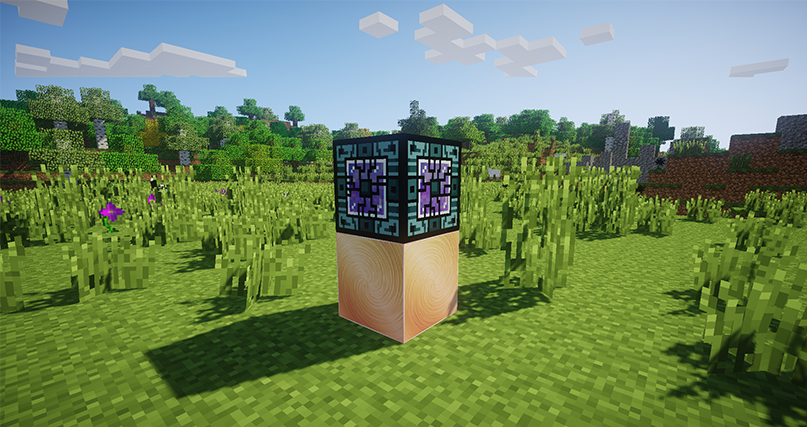

# Улучшенные версии механизмов

Для многих механизмов появились _расширенная сингулярная_ и _промышленно сингулярная_ версии на 6 и 12 слотов соответственно. Механизмы, получившие улучшенные версии: _дробитель_, _экстрактор_, _электропечь_, _утилизатор_,\
_компрессор_.

<figure><figcaption>
Новые сингулярные механизмы
</figcaption></figure>

### Объединитель материи "Жидкой"

Хранит в себе _генераторы жидкой материи_. Используя этот механизм, можно уменьшить количество механизмов на своей территории и сделать свою МЭ сеть более эффективной. В перспективе этот новый механизм поможет немного оптимизировать работу сервера.

<figure><figcaption>
Объединитель жидкой материи
</figcaption></figure>

### Объединитель нейтрония

Хранит в себе _сингулярные_ _генераторы нейтрония_. Также призван помочь с оптимизацией МЭ сети и работы сервера.

<figure><figcaption>
Объединитель нейтрония
</figcaption></figure>

### Ферма визеров

Перерабатывает _головы скелетов-иссушителей_ и _песок душ_ в _звезды ада_, используя энергию или ману.

<figure><figcaption>
Ферма визеров
</figcaption></figure>

### Квантовый репликатор

Более эффективный аналог обычного _репликатора._ Имеет сразу 3 слота для результата крафта и может производить до 64 предметов за операцию, если хватает материи.

Также имеет дополнительный слот для более удобной настройки шаблона: в новый слот нужно положить предмет, который требуется произвести.

<figure><figcaption>
Квантовый репликатор
</figcaption></figure>
