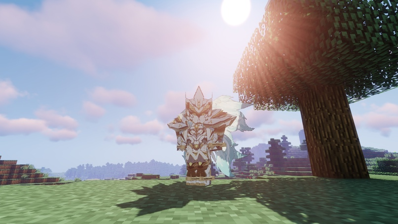
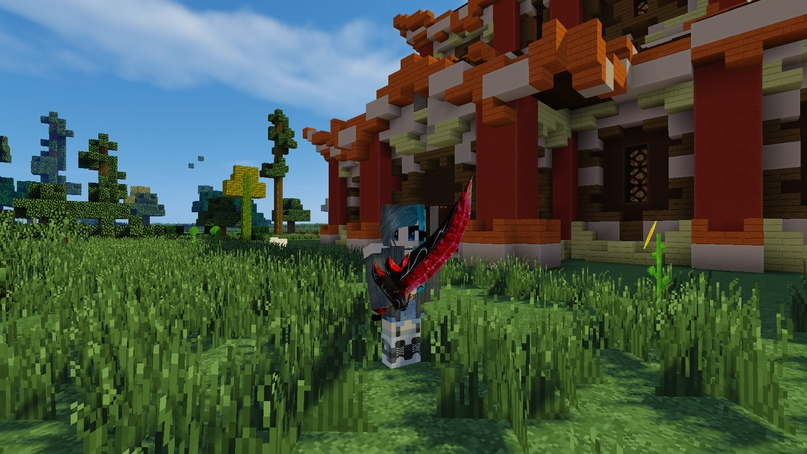
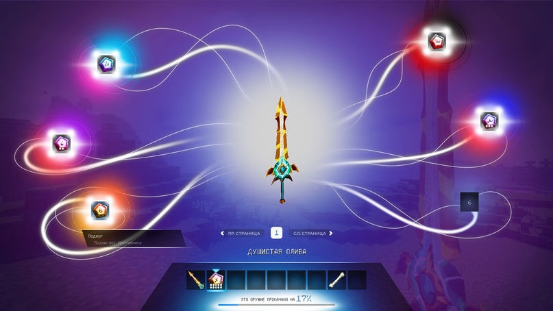

# Оружие и броня с 3D-моделями

#### В игру пришли **множество** **новых вида оружия и брони с 3D-моделями**, а также **улучшения** и **компоненты для крафта,** а также **новое игровое меню**.

Создавайте мощнейшее оружие с различным дизайном, используя уникальные компоненты для крафта: _ядро создания_, _кодирующие пластины_, _энергетические ядра_, _листы из ниобия_ и многое другое, а еще три вида кристаллов!

<figure><figcaption>
Броня Бога ветра
</figcaption></figure>

<figure><figcaption>
Клинок Мурамасы
</figcaption></figure>


Все крафты можно посмотреть в NEI прямо в игре.


Откройте **новое игровое меню**, держа в руках новое оружие или элемент брони и зажав клавишу «**`F`**». Здесь вы можете вставлять всевозможные улучшения, чтобы сделать ваше оружие или элемент брони как можно мощнее.

<figure><figcaption>
Новое игровое меню. Улучшение оружия
</figcaption></figure>


Какие имеются улучшения вы можете узнать в самой игре.

