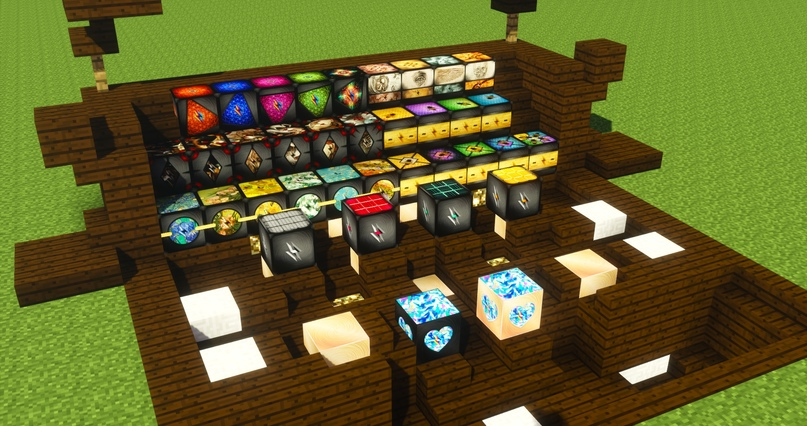
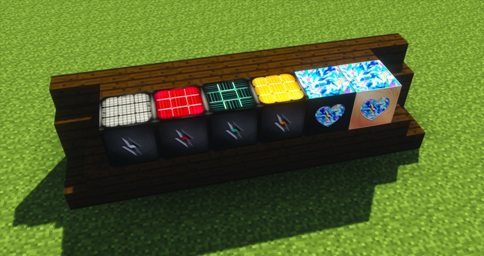
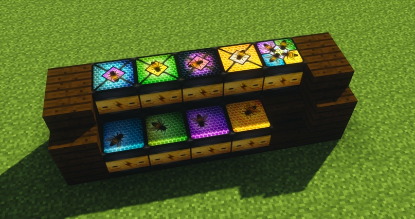
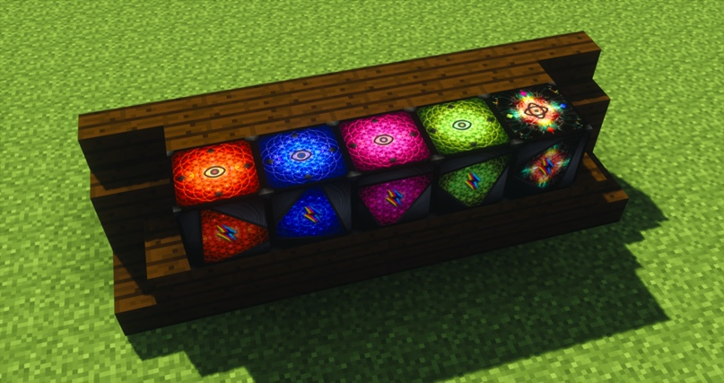
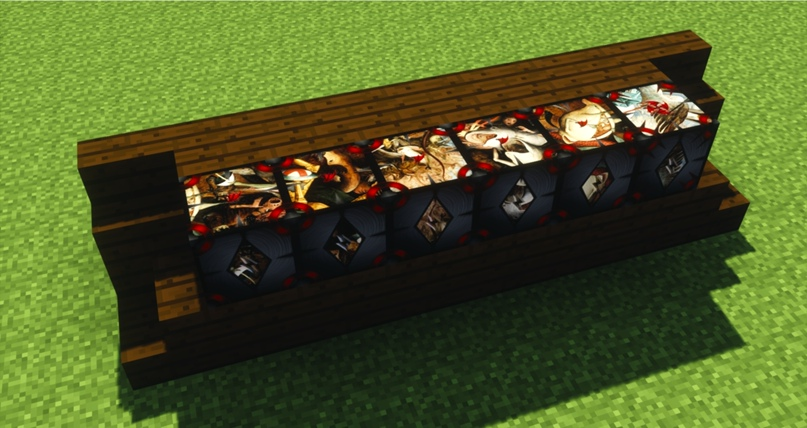
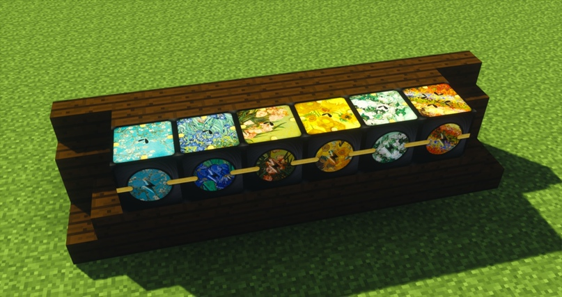
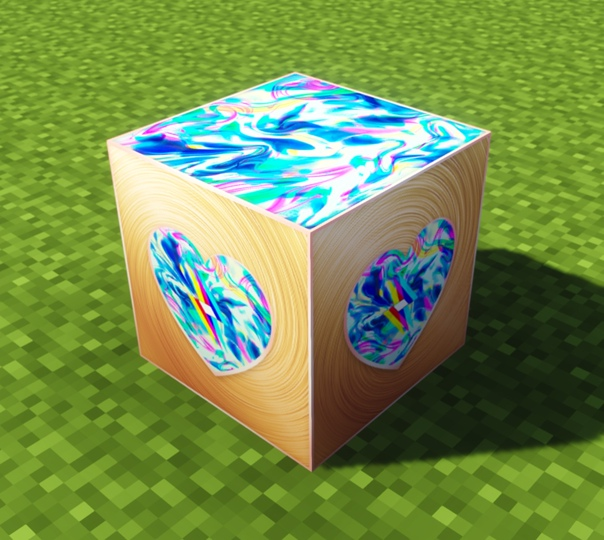
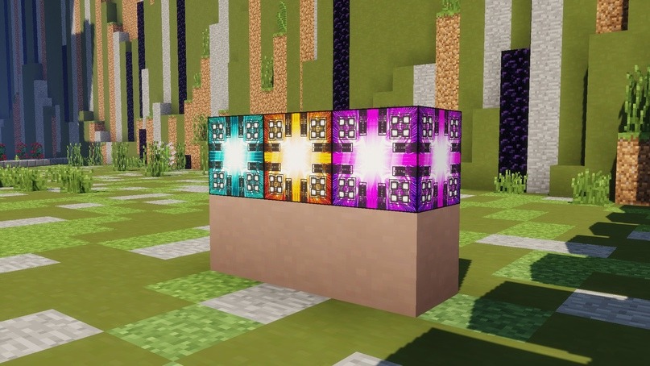

# Солнечные Панели

<figure><figcaption></figcaption></figure>

### Основные солнечные панели

<figure><figcaption></figcaption></figure>

Слева направо: _дисперсионная_, _гравимагнитная_, _анизотропическая_,\
_флуктуационная солнечная панель_, _искрящаяся панель_,\
_искрящаяся панель в корпусе из розового золота_.


Чтобы посмотреть крафты, воспользуйтесь _NEI_ в игре.


> А еще в крафтах всех новых панелей будет использоваться 10 новых видов материи. Самая лучшая из них — _искрящаяся._ Она будет использоваться в самых топовых крафтах.

### Панели для мода [<mark style="color:yellow;">Forestry</mark>](broken-reference)

<figure><figcaption>
Солнечные панели для мода Forestry
</figcaption></figure>

Для мода _Forestry_ мы добавили 9 новых панелей: я_нтарную_, _голубую_, _зеленую_, _фиолетовую панели пчеловода_, соответствующие им _улучшенные панели пчеловода_, а также _ультимативную четырехцветную панель пчеловода_ — самую лучшую в этой ветке панелей.

> Для создания этих панелей вам предстоит глубоко изучить мод [_<mark style="color:yellow;">Forestry</mark>_](broken-reference)

### Панели для мода <mark style="color:purple;">Thaumcraft</mark>

<figure><figcaption>
Солнечные панели для мода Thaumcraft
</figcaption></figure>

> Для крафта этих панелей вам предстоит нарушить много запретов. Проведите волнующие и экстремальные запретные исследования, чтобы получить _ультимативную запретную инфернальную панель_. Скрафтите _живую плоть_, _потрепанное птичье крыло_, _ужасающее нечто_ и другие предметы, чтобы получить 4 вида _кластеров_. Используйте матрицу из мода Thaumcraft, чтобы создать новые панели. Исследуйте феномен смерти, чтобы получить как можно больше энергии!

### Панели для мода <mark style="color:green;">DivineRPG</mark>

<figure><figcaption>
Солнечные панели для мода DivineRPG
</figcaption></figure>

> Путешествуйте по измерениям мода _<mark style="color:green;">DivineRPG</mark>_, чтобы добыть ресурсы, необходимые для создания новых панелей. Крафтите _камни Мортума_, _камни Подземелья тайн_, _камни сновидений_ и _камни кошмаров_ и соответствующие им _темные_ и _пробужденные камни_, чтобы получить _сплавы_, которые станут основой новых панелей.

### Панели для мода <mark style="color:purple;">DraconicEvolution</mark>

<figure><figcaption>
Солнечные панели для мода DraconicEvolution
</figcaption></figure>

> Изучайте мод _<mark style="color:purple;">DraconicEvolution</mark>_, убейте дракона, чтобы получить ресурсы, необходимые для новых крафтов. Создайте _ядра дракона_, наполните их _обработанной кровью дракона_ и превратите в мощнейшие _панели убийцы дракона_.

### Панели для мода <mark style="color:blue;">Botania</mark>

<figure><figcaption>
Солнечные панели для мода Botania
</figcaption></figure>

> Исследуйте мод _<mark style="color:blue;">Botania</mark>_, чтобы скрафтить новые предметы: _цветы олеандра_, _пустой магический бутон,_ _лепестки подсолнуха_ и многое другое. Наполняйте _магический бутон_ различными цветами, чтобы получить _наполненные бутоны_, которые станут сердцем будущих панелей. Используйте силу растений, чтобы создать эти удивительные солнечные панели!

### <mark style="color:red;">Искрящаяся панель</mark>

<figure><figcaption>
Искрящаяся панель в корпусе из розового золота
</figcaption></figure>

> Из всех панелей, созданных с использованием модов, и предметов из мода Avaritia вы можете создать _искрящуюся панель_. Она объединит все ваши исследования и достижения в одну небольшую, красивую и невероятно мощную панель, способную максимально эффективно обеспечить вас энергией. На данный момент эта панель лучшая в игре. Желаем удачи в ее крафте!
>
> По умолчанию искрящаяся панель черного цвета.
>
> Однако вы можете улучшить свою искрящуюся панель и сделать ее внешний вид более интересным. Для этого используйте _слитки розового золота_ и скрафтите _искрящуюся панель в корпусе из розового золота_.

### Квантовые генераторы

<figure><figcaption>
Новые квантовые генераторы
</figcaption></figure>

В игру пришли 3 новых _квантовых генератора_: _параллактический бирюзовый квантовый генератор, ионный желтый квантовый генератор_, _ультимативный фиолетовый квантовый генератор_.
