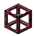
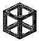
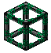
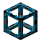
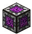

# LoliTechnologies

#### **В игру пришел новый уникальный аддон **_**LoliTechnologies**_**, дополняющий мод **_**Applied Energistics**_**. Он поможет вам создавать более эффективные и удобные в использовании МЭ системы.**

### Молекулярный сборщик(Экстремальный)

Используется для экстремальных крафтов (9х9) из Avaritia. Чтобы закодировать для него шаблон нам понадобится **"МЭ терминал экстремальных крафтов"** и обычный шаблон. Готовый шаблон можно положить в интерфейс сборщика, либо в МЭ интерфейс подключенный к сборщику.

### _Нейтронный последовательный сборщик_

Представляет собой замену нейтронного компрессора. Чтобы он работал, нужно его подключить к МЭ сети. Вместо шаблона, использует **"Диск с нейтронными шаблонами"**. Для кодировки диска, используется **"Нейтронный кодировщик"**, нужно положить диск в специальный слот, взять нужный блок для сингулярности и запомнить крафт.

### **Ускоренный молекулярный сборщик**

Работает быстрее, чем обычный, и сможет помочь вам сделать свою МЭ сеть эффективнее.

### **Молекулярный сборщик(Матричный)**

Используется для упрощенной автоматизации крафтов из Thaumcraft. Чтобы закодировать крафт, нам понадобится Матричный кодировщик и Диск с матричными шаблонами. Кладём диск в кодировщик, выкладываем крафт и сохраняем его

### **Улучшенный магический сборщик**

Представляет собой улучшенную версию обычного Магического сборщика, но может хранить в себе 100.000 вис.

### **Блоки обработки создания(9 / 81 / 729)**

Данный блок является элементом **Многоблочного процессора**, отвечающий за доставку предметов из МЭ сети в **Хранилища создания**, и из **Хранилища создания** в МЭ интерфейс. Увеличивая количество блоков обработки создания в **Многоблочном процессоре** вы ускоряете процесс доставки предметов в крафте/обработке.

<table data-header-hidden><thead><tr><th width="325"></th><th></th></tr></thead><tbody><tr><td>256К Хранилище создания</td><td>хранит в себе 256к байт памяти для крафта</td></tr><tr><td>1024К Хранилище создания</td><td>хранит в себе 1024к байт памяти для крафта</td></tr><tr><td>4096К Хранилище создания</td><td>хранит в себе 4096к байт памяти для крафта</td></tr><tr><td>32М Хранилище создания</td><td>хранит в себе 32м байт памяти для крафта</td></tr><tr><td>128М Хранилище создания</td><td>хранит в себе 128м байт памяти для крафта</td></tr><tr><td>512М Хранилище создания</td><td>хранит в себе 512м байт памяти для крафта</td></tr><tr><td>2048М Хранилище создания</td><td>хранит в себе 2048м байт памяти для крафта</td></tr></tbody></table>

### Ячейки хранения с большим объёмом



| 32М МЭ ячейка хранения    |   |
| ---------------------------------------------------------------------- | - |
| 64М МЭ ячейка хранения    |   |
| 128М МЭ ячейка хранения  |   |



<table data-header-hidden><thead><tr><th width="380"></th><th></th></tr></thead><tbody><tr><td>32М МЭ ячейка хранения жидкости </td><td></td></tr><tr><td>64М МЭ ячейка хранения жидкости </td><td></td></tr><tr><td>128М МЭ ячейка хранения жидкости </td><td></td></tr></tbody></table>



<table data-header-hidden><thead><tr><th width="382"></th><th></th></tr></thead><tbody><tr><td>32М МЭ ячейка хранения эссенции </td><td></td></tr><tr><td>64М МЭ ячейка хранения эссенции </td><td></td></tr><tr><td>128М МЭ ячейка хранения эссенции </td><td></td></tr></tbody></table>



### Улучшенные версии МЭ кабелей

<table data-header-hidden><thead><tr><th width="294"></th><th></th></tr></thead><tbody><tr><td>Улучшенный МЭ кабель</td><td>Проводит 64 канала</td></tr><tr><td>Ультимативный МЭ кабель</td><td>Проводит 128 каналов</td></tr><tr><td>Квантовый МЭ кабель</td><td>Проводит 256 каналов</td></tr></tbody></table>

### Улучшенный МЭ интерфейсы

| МЭ интерфейс Х2 (18 шаблонов)      | Позволяет хранить 18 шаблонов внутри. |
| --------------------------------------------------------------------------------------------------- | ------------------------------------- |
| МЭ интерфейс Х3 (27 шаблонов)  | Позволяет хранить 27 шаблонов внутри. |
| МЭ интерфейс Х4 (36 шаблонов)  | Позволяет хранить 36 шаблонов внутри. |

### Беспроводные соединители

<table data-header-hidden><thead><tr><th width="429"></th><th></th></tr></thead><tbody><tr><td>Улучшенный Беспроводной соединитель </td><td>Проводит 64 канала</td></tr><tr><td>Ультимативный Беспроводной соединитель </td><td>Проводит 128 каналов</td></tr><tr><td>Квантовый Беспроводной соединитель </td><td>Проводит 256 каналов</td></tr></tbody></table>

### Иные предметы&#x20;

| Изменчивый агрегатор                         | Используется для создания кристаллов                                                             |
| ------------------------------------------------------------------------------------------------------------- | ------------------------------------------------------------------------------------------------ |
| Пульсирующая центрифуга                      | Используется для создания кристаллов                                                             |
| Расширенный МЭ накопитель                | Улучшенная версия МЭ накопителя, имеет 20 слотов для ячеек                                       |
| Гибридная плотная энергетическая ячейка  | Хранилище энергии                                                                                |
| Нейтронный кодировщик                    | Используется для кодирования Диска с нейтронными шаблонами                                       |
| Матричный кодировщик                         | Используется для кодирования Диска с матричными шаблонами                                        |
| Печать Азанора                                 | Отменяет затраты вис в Совершенной пасеке, магическом сборщике, молекулярном сборщике(матричный) |
| Квантовая Карта Ускорения                              | Улучшенная версия привычной _карты ускорения_. Мощность увеличена в 6 раз.                       |
| Набор для настройки беспроводного соединителя                      | Используется для привязки новых соединителей                                                     |

